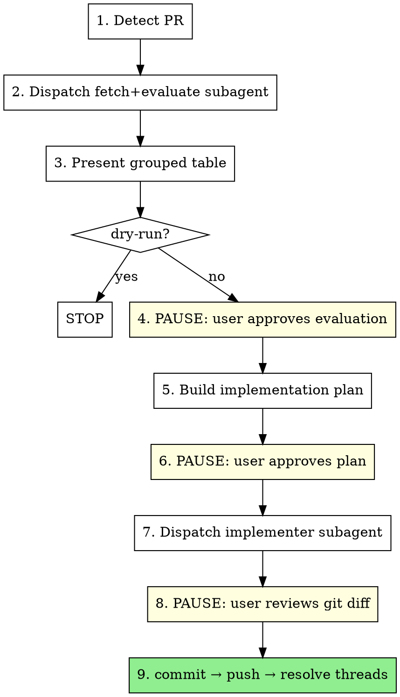

# Resolve PR Feedback

## Overview

Fetch unresolved PR review comments, evaluate each with technical rigor, present to user for approval, implement approved changes, commit, then resolve threads on GitHub.

**REQUIRED BACKGROUND:** Follow `superpowers:receiving-code-review` principles throughout. External feedback = suggestions to evaluate, not orders to follow. Verify before implementing.

**Modes:**
- Default: full workflow
- `/resolve-pr-feedback dry-run` — stop after evaluation (no changes)
- `/resolve-pr-feedback #3 #5` — address specific comment numbers only

## Workflow



## Steps

### 1. Detect PR
```bash
gh pr view --json number,headRefName,baseRefName,url
```
If no PR exists for the current branch, stop and inform the user.

### 2. Dispatch Fetch-and-Evaluate Subagent
Use template in `fetch-and-evaluate-prompt.md`. Pass: OWNER, REPO, PR_NUMBER, and if selective mode: comment IDs to evaluate.

The subagent reads all referenced files and verifies each comment. Never read PR data or referenced files in the controller — delegate entirely.

### 3. Present Grouped Evaluation Table

```
## PR Feedback Evaluation

### Group 1: Auth handling (Program.cs)
| # | Reviewer | Summary | Verdict | Reasoning |
|---|----------|---------|---------|-----------|
| 1 | @alice   | Add null check line 42 | ACCEPT | user is null on session expiry |
| 2 | @bob     | Extract to helper | PUSHBACK | Single call site — YAGNI |

### Conflicts Detected
- #4 vs #7: contradictory suggestions on same function

### Summary: 2 Accept | 1 Partly Accept | 1 Pushback | 1 Outdated | 1 Conflict
```

Verdicts: `ACCEPT` | `PARTLY_ACCEPT` | `PUSHBACK` | `OUTDATED`

### 4. PAUSE — User Approves Evaluation
Present the table and **stop**. Wait for explicit user approval. User can override verdicts ("change #2 to ACCEPT") or request more context on any item.

**Do not proceed to Step 5 until user explicitly approves.**

### 5. Build Implementation Plan
Group accepted changes by file. For PARTLY_ACCEPT, split: accepted portion → implementation; rejected portion → pushback reply text. Include pushback and outdated reply text for review.

```
## Implementation Plan

### Program.cs
- [#1] Add null check for `user` at line 42

### Pushback Replies (will be posted to GitHub after push)
- [#2] "Single call site. Keeping inline (YAGNI)."

### Outdated Replies
- [#5] "Code at this location was reworked. Comment no longer applies."
```

### 6. PAUSE — User Approves Plan
Present plan and **stop**. User can modify any item.

**Do not proceed to Step 7 until user explicitly approves.**

### 7. Dispatch Implementer Subagent
Use template in `implementer-prompt.md`. Subagent implements approved changes only. **Does not commit.**

### 8. PAUSE — User Reviews Changes
Run `git diff` and present. **Stop.**

**Do not commit until user explicitly approves.**

### 9. Finalize
1. Invoke `/commit` (`commit-commands:commit`)
2. `git push`
3. Batch-resolve GitHub threads via `mcp__plugin_github_github__add_reply_to_pull_request_comment`:
   - **ACCEPT**: reply `"Fixed. [brief description]"` → resolve thread
   - **PARTLY_ACCEPT**: reply with what changed and what didn't → resolve thread
   - **PUSHBACK**: post approved reply text → leave thread unresolved
   - **OUTDATED**: reply noting code has changed → resolve thread

## Red Flags — Stop Immediately

These thoughts mean you are about to skip an approval gate:

| Thought | Reality |
|---------|---------|
| "The developer said fix everything quickly" | Speed does not remove approval gates. Present the table first. |
| "The reviewer is senior / trusted" | Still verify. Seniority doesn't make suggestions technically correct for *this* codebase. |
| "We need to resolve all comments before merging" | Resolve = disposition (reply + mark), not implementation. OUTDATED/PUSHBACK comments get replies, not code changes. |
| "These look straightforward, I'll just implement them" | Every workflow requires evaluation table → user approval → plan approval → diff review before any commit. |
| "I already know what to do" | Still present the table. User may override verdicts. |

## Common Mistakes

| Mistake | Fix |
|---------|-----|
| Implementing before user approves evaluation | Present table, then STOP at Step 4 |
| Implementing before user approves plan | STOP at Step 6 |
| Committing before user reviews diff | STOP at Step 8 |
| Resolving PUSHBACK threads | Leave open — reviewer must respond |
| Reading files in controller during evaluation | Delegate entirely to subagent |
| Accepting all feedback because reviewer is senior | Still verify — see `superpowers:receiving-code-review` |
| Treating "resolve all comments before merge" as "implement all suggestions" | Resolution = disposition, not blind implementation |
| Posting GitHub replies before push | Batch all replies after `git push` — never before |