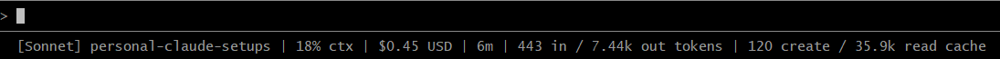

# personal-claude-setups

Personal [Claude Code](https://claude.ai/code) configurations, agents, and skills used across my projects. Shared for reference and reuse.

## Contents

```
.claude/
├── CLAUDE.md                          # Personal environment instructions
├── settings.json                      # Model, plugins, and statusline config
├── statusline-command.sh              # Custom statusline script
├── agents/
│   ├── api-developer.md
│   ├── blazor-developer.md
│   ├── database-migration-specialist.md
│   ├── documentation-writer.md
│   ├── feature-flag-remover.md
│   ├── logging-specialist.md
│   ├── security-reviewer.md
│   └── test-coverage-engineer.md
└── skills/
    └── resolve-pr-feedback/
        └── SKILL.md
```

## Custom Statusline

The `settings.json` wires up a custom statusline via `statusline-command.sh` that surfaces real-time session information directly in the Claude Code UI.



**Displays:**
- Active model name
- Current project directory
- Context window usage percentage
- Estimated session cost (USD)
- Cumulative input / output tokens

The script handles Windows environments using Git Bash, including fallback `jq` path detection across common install locations (Chocolatey, WinGet, manual installs).

## Agents

| Agent | Purpose |
|---|---|
| `api-developer` | RESTful API design, conventions, error handling, and security |
| `blazor-developer` | Blazor WebAssembly components with MudBlazor |
| `database-migration-specialist` | Safe DB schema migrations (DbUp, EF Core, FluentMigrator) |
| `documentation-writer` | Structured Markdown documentation |
| `feature-flag-remover` | Safely removing deprecated feature flags and their conditional logic |
| `logging-specialist` | Structured Serilog logging with Application Insights integration |
| `security-reviewer` | OWASP Top 10 security reviews and fixes |
| `test-coverage-engineer` | xUnit / Shouldly / BUnit / Moq test authoring |

## Skills

### `resolve-pr-feedback`

A systematic multi-step workflow for resolving GitHub PR review comments with explicit approval gates before any changes are made. Fetches and evaluates all review threads, presents a verdict table (`ACCEPT` / `PARTLY_ACCEPT` / `PUSHBACK` / `OUTDATED`), and proceeds only after user confirmation at each stage.

## Environment

These configs target:
- **OS:** Windows 11
- **Shell:** Git Bash
- **Paths:** Unix-style forward slashes
- **Encoding:** UTF-8 without BOM

## License

MIT
